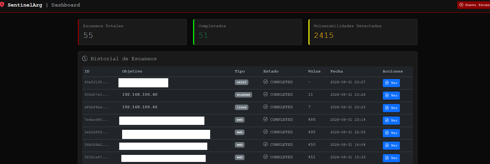

# 🛡️ SentinelArg - Advanced Offensive Security Platform



**SentinelArg** is an AI-powered offensive security automation platform designed for authorized penetration testing, red team operations, CTF competitions, and security research.

---

## ️ Legal Notice

**This tool is intended for AUTHORIZED security testing ONLY.**

- ✅ Authorized penetration testing
- ✅ Ethical security research
- ✅ CTF (Capture The Flag) competitions
- ✅ Security audits with explicit written authorization

**Unauthorized use is ILLEGAL and may result in civil and criminal prosecution.**

See [LICENSE](LICENSE) for complete terms.

---

##  Features

### 🌐 Web Application Scanning
- **Technology Detection**: WhatWeb, Wafw00f, etc...
- **Content Discovery**: Katana, Gau, FFUF, etc...
- **Vulnerability Scanning**: Nuclei, Dalfox, Nikto, etc...
- **SSL/TLS Analysis**: testssl.sh, etc...
- **Secret Detection**: Gitleaks, etc...

### 🪟 Windows & Active Directory
- **Network Enumeration**: Nmap, NetExec, Nbtscan, etc...
- **AD Assessment**: BloodHound, Certipy, etc...
- **Credential Harvesting**: Responder (LLMNR/NBT-NS), etc...
- **Share Enumeration**: SMBMap, Enum4linux, etc...

### 🐧 Linux Server Auditing
- **Service Detection**: Nmap, SSH-Audit, etc...
- **Vulnerability Assessment**: Nuclei, etc...
- **Configuration Analysis**: WhatWeb, etc...

###  Network Discovery
- **Port Scanning**: Nmap (comprehensive), etc...
- **OS Detection**: Advanced fingerprinting, etc...
- **Service Enumeration**: Nbtscan, etc...

### 🧠 AI-Powered Intelligence
- **Automatic Exploit Search**: Searchsploit, Exploit-DB API, Metasploit, etc...
- **Smart Tool Selection**: Context-aware parameter optimization, etc...
- **Intelligent Error Recovery**: Automatic fallback strategies, etc...

### 📊 Professional Reporting
- **Executive PDF Reports**: Clean, professional format
- **Compliance Mapping**: OWASP Top 10, MITRE ATT&CK, CWE
- **Severity Classification**: Critical, High, Medium, Low, Info
- **Exploit Database**: Integrated vulnerability references

---

## 📦 Installation

### Option 1: Docker (Recommended)

```bash
# Clone the repository
git clone https://github.com/alfasierra/sentinelarg.git
cd sentinelarg

# Build and run
docker-compose up -d

# Access the dashboard
open http://localhost:8888
